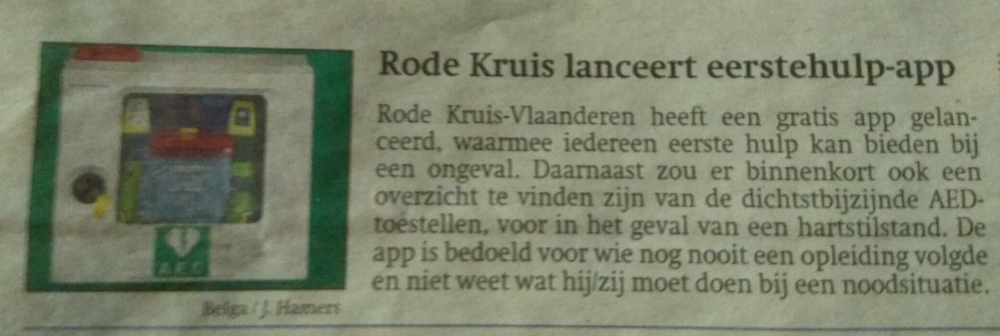

# Elevator Pitch
## 5-04

---

@snap[north span-100 headline]
## De zoektocht naar een doelgroep
@snapend

@snap[west span-50]

@size[0.5em]("Ik heb intuïtief het gevoel dat andere sectoren misschien meer kans hebben omdat zowel cliënten als begeleiders dit als heel zinvol zullen ervaren, terwijl dit in de jeugdzorg minder is, omdat je juist zit met die emotionele problematiek.")
 
@size[0.4em](-Iris Storme, docent orthopedagogie HoGent)

@snapend

@snap[east span-50]

@size[0.5em]("Je kan niet inschatten of ze zich op hun gemak gaan voelen bij u. Bij de één gaat dat heel spontaan na vijf minuten zijn en bij de ander een paar maand. Er zijn doelgroepen die veel gemakkelijker bereikbaar zijn en misschien moet je daar eens gaan kijken.")
 
@size[0.4em](-Margot De Donder)

@snapend

---

## Eureka!

---
@snap[north span-100 headline]
## In the meantime..
@snapend

@snap[west span-50]

### Google Home

@snapend

@snap[east span-50]

### Mycroft.AI
@snapend
